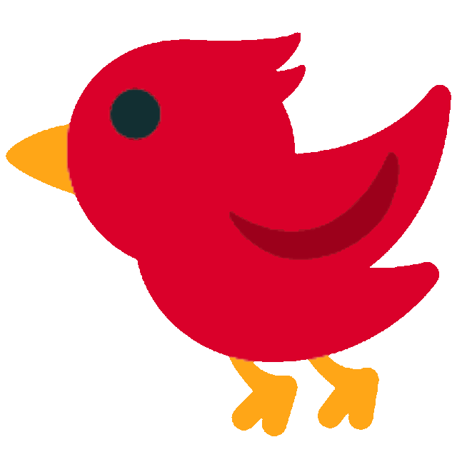
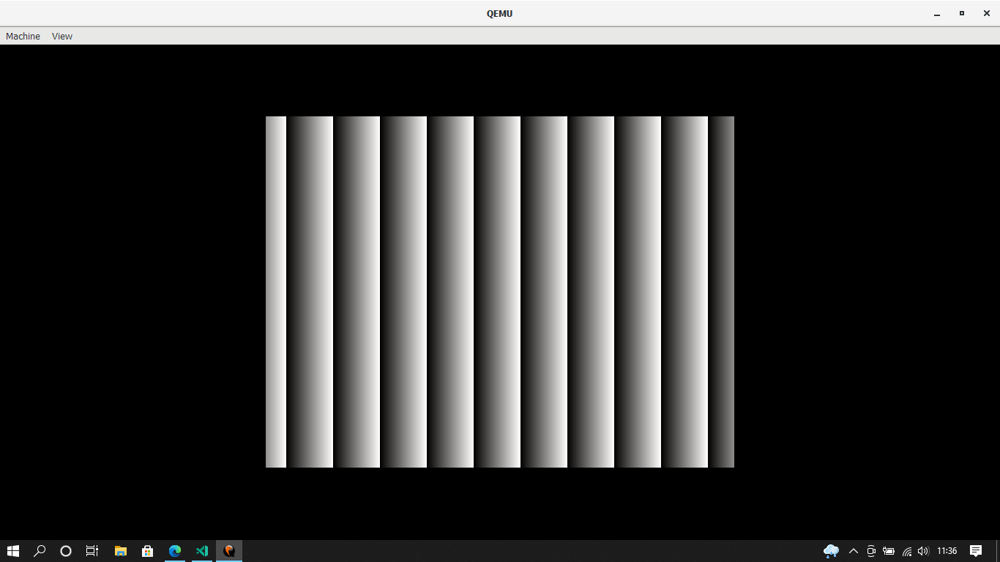

# BirdOS

BirdOS is an operating system developed for hobbies and science based on [BlogOS](https://github.com/phil-opp/blog_os) by Philipp Oppermann. BirdOS is a very simple system so it should not be considered as a full fledged operating system. Currently BirdOS is under heavy development so both the system and the documentation is not perfect and not everything will always work.

# DEMO
Below you will find screen view of the current version of the system:

# DOCUMENTATION

- [SETUP.md](./SETUP.md) - Preparing to build BirdOS
- [FILES.md](./FILES.md) - Information about particular files
- [CONTRIBUTING.md](./CONTRIBUTING.md) - Information about how to contribute to the project 

# LICENSING
Besides the **bootloader** submodule which is licensed under its own license, ( You can read more [here](https://github.com/rust-osdev/bootloader) ) the project is licensed under the [MIT LICENSE](./LICENSE)
# REFERENCES 
