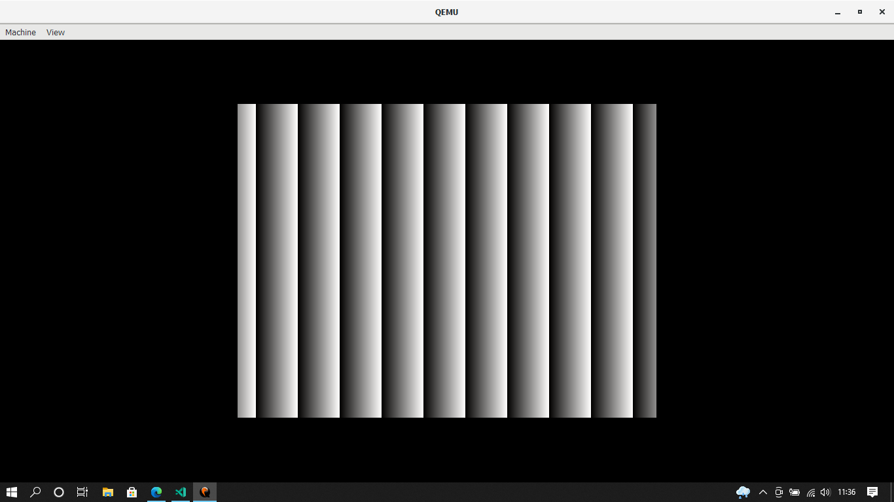

# BirdOS
BirdOS  to system operacyjny stworzony dla hobbi i nauki na podstawie [BlogOS](https://github.com/phil-opp/blog_os) Philippa Oppermanna. BirdOS to system bardzo prosty więc nie należy go traktować jako pełnoprawny system operacyjny. Obecnie BirdOS jest w ciężkim rozwoju więc zarówno sam system jak i dokumentacja nie jest idealna i nie zawsze wszystko będzie działać.

# DEMO
Poniżej znajdziesz screen widoku z aktualnej wersji systemu:

# DOKUMENTACJA

- [SETUP.md](./SETUP.md)  - Przygotowanie do zbudowania BirdOS
- [FILES.md](./FILES.md)  - Informacje o poszczególnych plikach
- [CONTRIBUTING.md](./CONTRIBUTING.md) - Informacje o tym jak włożyć swój wkład w projekt 

# LICENCJONOWANIE
Oprócz submodułu `bootloader` który jest licencjonowany według własnej licencji, ( Więcej przeczytasz  [tutaj](https://github.com/rust-osdev/bootloader)  ) projekt jest licencjonowany na [LICENCJI MIT](./LICENSE)
# REFERENCJE 